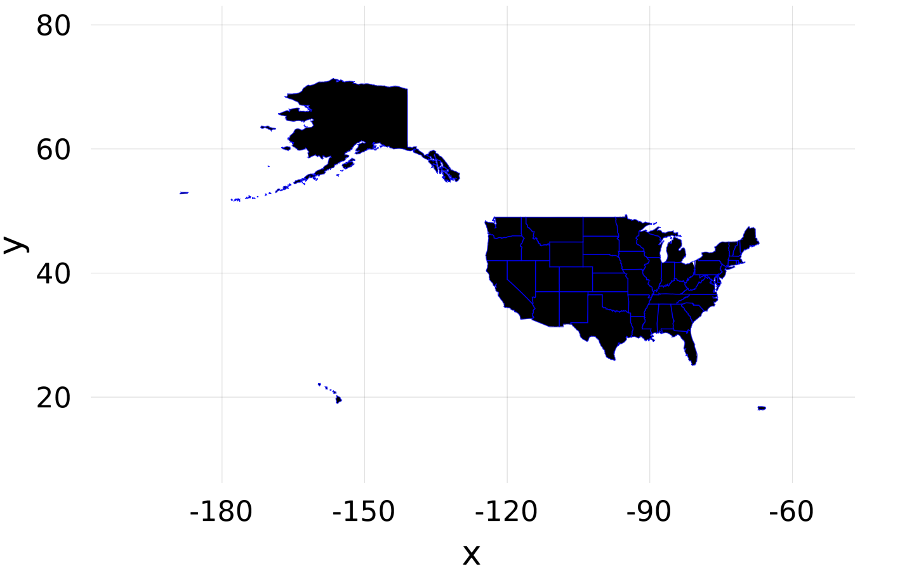

# GeoMakie
## Geographic plotting utilities for [Makie.jl](https://github.com/JuliaPlots/Makie.jl)

[](https://asinghvi17.github.io/GeoMakie.jl/stable)
[](https://asinghvi17.github.io/GeoMakie.jl/dev)
[](https://travis-ci.com/asinghvi17/GeoMakie.jl)
[](https://gitlab.com/asinghvi17/GeoMakie.jl/pipelines)
[](https://gitlab.com/asinghvi17/GeoMakie.jl/commits/master)

## Installation

This package is **in development** and will **break often**.  As it is currently unregistered, you can install it from the REPL like so:
```julia
]add https://github.com/JuliaPlots/GeoMakie.jl
```

## Examples

```julia
using GeoJSON, GeoMakie, Makie
states = download("https://raw.githubusercontent.com/PublicaMundi/MappingAPI/master/data/geojson/us-states.json")

states_geo = GeoJSON.parse(read(states, String))

poly(states_geo, strokecolor = :blue, strokewidth = 1)
```


These plots can be arbitrarily colored using the `color` keyword, and the Makie poly interface is also exposed.
All that this package is (as of now) is some definitions for argument conversion.

## Performance

Since this is Makie, all the plots are pretty interactive; however, sometimes the triangulation routines native to GLMakie cann take some time - for me, it takes 20 seconds to plot 402 polygons with them.  However, I've got an experimental technique using Earcut.jl working, which cuts this time down to 0.1 seconds.  When I integrate that fully with a recipe for meshes / polys, then I'll push that.

## Planned features
- A `choropleth` recipe which can read data from the properties of a FeatureCollection
- helper functions to extract "columns" of a FeatureCollection
