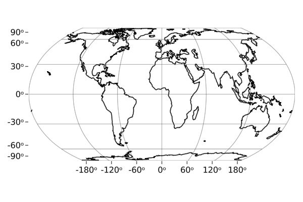
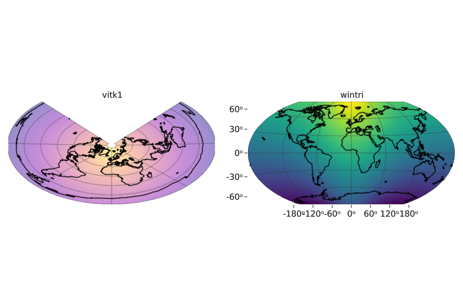

# GeoMakie
## Geographic plotting utilities for Makie.jl <a href = "https://www.github.com/JuliaPlots/Makie.jl"></a>

[](https://JuliaPlots.github.io/GeoMakie.jl/stable)
[](https://JuliaPlots.github.io/GeoMakie.jl/dev)
[](https://gitlab.com/JuliaGPU/GeoMakie-jl/pipelines)

## Installation

This package is **in development** and will **break often**. In order to start using `GeoMakie` make sure to also add a backend (GLMakie, CairoMakie, WGLMakie), namely:

```julia
] add GLMakie GeoMakie
```

You may check the installed versions with:

```julia
] st GLMakie GeoMakie
```

Start using the package:

```julia
using GLMakie, GeoMakie
```

# Quick start

The following examples are supposed to be self-explanatory. For further information [check out the documentation here!](https://juliaplots.org/GeoMakie.jl/stable/)

### A simple map

```julia
fig = lines(GeoMakie.coastlines(); color = :black, axis = (; type = GeoAxis))
save("coastlines.png", fig; resolution = (600,400))
fig
```

The GeoAxis default's projection is [Equal Earth](https://proj.org/operations/projections/eqearth.html).



### A more colorful map with a different projection can be done with:

```julia
lons = -180:180
lats = -90:90
field = [exp(cosd(l)) + 3(y / 90) for l in lons, y in lats]

fig = Figure()
ax1 = GeoAxis(fig[1, 1], dest = "+proj=vitk1 +lat_1=45 +lat_2=55",
    coastlines = true, title = "vitk1")
ax2 = GeoAxis(fig[1, 2], dest = "+proj=wintri",
    coastlines = true, title = "wintri")
surface!(ax1, lons, lats, field; shading = false, colormap = (:plasma, 0.45))
surface!(ax2, lons, lats, field; shading = false)
hidedecorations!(ax1)
save("projections.png", fig; resolution = (900, 600))
fig
```



Unfortunately, there are still plenty of projection that don't work out of the box, i.e. orthographic, Lambert Conformal Conic, etc.
